# Truthful News

## Welcome to Truthful News
**Truthful News** is a hackathon-built platform providing clear, verified, and trending news to combat misinformation and promote media literacy. With short updates and tools to verify headlines, it empowers users—whether beginners or critical thinkers — to navigate current events confidently. Accessible anytime, on any device. User's local weather forcast as a pleasent bonus.

**Purpose:** A real-time news and fact-checking platform designed to empower users with verified information and combat misinformation through clear, accessible content display.

**Target Audience:** Politically aware citizens, non-native speakers, mobile users, and misinformation-conscious individuals seeking reliable news verification.

**Mission:** We help users stay informed with short, easy-to-read updates and simple tools to verify headlines and viral claims, supporting critical thinking and reliable information sharing.

---

## Key Benefits

- **Trustworthy Information**: Short, clear news updates and fact-checked content to avoid misinformation.
- **Beginner-Friendly Design**: Simple language and layout for non-native speakers and new internet users.
- **Critical Thinking Support**: Tools to question sources and think critically.
- **Mobile Access**: Responsive design for any device, anytime.
- **Community Value**: Empowers informed decisions and sharing of reliable content.
- **Real-Time Updates**: Stay informed with the latest verified news as it happens.
- **Customizable Experience**: Filter news by topics, regions, or sources to suit your interests.
- **Enhanced Accessibility**: Designed with WCAG compliance for users with disabilities.
- **Data Privacy**: No intrusive tracking or data collection, ensuring user trust and security.
- **Global Perspective**: Access news from diverse sources worldwide for a well-rounded view.

---

## Why It Matters

In today’s digital age, misinformation spreads rapidly, influencing public opinion and decision-making. Media literacy is essential to:

- **Combat Misinformation**: Equip users with tools to verify claims and identify false narratives.
- **Promote Critical Thinking**: Encourage questioning of sources and deeper analysis of information.
- **Foster Trust in Media**: Build confidence in reliable news sources through transparency and fact-checking.
- **Empower Communities**: Enable informed decision-making and responsible content sharing.

Truthful News addresses these challenges by providing a platform that prioritizes accuracy, accessibility, and user empowerment.

## Table of Contents

- [Welcome to Truthful News](#welcome-to-truthful-news)
- [Key Benefits](#key-benefits)
- [Why It Matters](#why-it-matters)
- [User Stories](#user-stories)
- [Website Planning and Construction](#website-planning-and-construction)
  - [Concept Discussion](#concept-discussion)
  - [Project Planning Stages](#️-project-planning-stages)
  - [Wireframes and Design](#-wireframes-and-design)
- [Technologies Used](#technologies-used)
- [Testing and Debugging](#testing-and-debugging)
- [Credits & Acknowledgments](#credits--acknowledgments)
  - [Design Resources](#design-resources)
  - [Development Tools](#development-tools)
  - [API Saurces](#api-saurces)
  - [Responsive Design Testing](#responsive-design-testing)
  - [Validator Testing](#validator-testing)
  - [Manual Testing](#manual-testing)
- [LightHouse Scores](#lighthouse-scores)
- [Deployment](#deployment)
- [Future Features](#future-features)

---

## User Stories

🧠 Political Awareness & Truth-Seeking

As a politically aware user, I want to compare multiple sources and see fact-checks with timestamps so that I can judge credibility and spot manipulation.

**Tasks**
- Create a fact-check section with claim, verdict, and source link.
- Add a timestamp to each fact-check.
- Build a layout that shows multiple headlines side-by-side.

**Features to Implement**
- HTML structure for fact-check cards.
- JavaScript to fetch and display data from a fact-check API.
- CSS grid or flexbox for side-by-side comparison.

📱 Mobile-Friendly Access

As a mobile user, I want the site to work well on my phone so that I can read and verify facts wherever I am.

**Tasks**
- Use media queries to adjust layout for small screens.
- Test buttons and text fields for touch usability.
- Ensure images and cards resize properly.

**Features to Implement**
- Responsive CSS with @media rules.
- Mobile-first layout using Flexbox or Grid.
- Scalable font sizes and tap-friendly buttons.

🧾 Clear Language & Guidance

As a non-native speaker or beginner, I want simple instructions and clear language so that I can understand how to use the site and trust the content.

**Tasks**
- Write a short intro and “How to Use” section.
- Use plain English in all headlines and fact-checks.
- Add tooltips or icons for extra help.

**Features to Implement**
- HTML sections for instructions and help.
- CSS styling for readability (font size, spacing).
- JavaScript tooltips or collapsible help boxes.

⚠️ Misinformation Awareness

As a concerned citizen, I want to know when fake news is trending so that I can avoid sharing harmful content that could mislead others.

**Tasks**
- Create a “Trending Claims” alert box.
- Highlight claims flagged as false or misleading.
- Add a share button for verified content.

**Features to Implement**
- JavaScript to fetch trending claims from an API.
- CSS styling for alert boxes and badges (e.g., “False”, “Verified”).
- HTML buttons with navigator.share() or copy-to-clipboard.

🔍 Search & Filtering

As a user, I want to search for specific claims or topics so I can find relevant information quickly.

**Acceptance Criteria**
- Search bar accepts input and returns matching results.
- Results highlight matching keywords.
- Optional autocomplete or recent searches.
- Works on desktop and mobile.

**Tasks**
- Build search bar component.
- Add JS logic to filter or fetch results.
- Highlight matches in result text.
- Implement autocomplete (optional).

🖼️ Detailed Claim View

As a user, I want to click on a claim and view full details so I can understand the context and verification process.

**Acceptance Criteria**
- Detail page shows full claim, verdict, source, and timestamp.
- Related claims are listed below.
- Share button and permalink are available.
- Navigation back to main feed is clear.

**Tasks**
- Build claim detail page or modal.
- Add related claims section.
- Implement share and permalink logic.
- Add breadcrumb or back button.

👓 Accessibility & Readability

As a visually sensitive user, I want clear contrast and readable fonts so I can comfortably consume content.

**Acceptance Criteria**
- Font sizes and spacing support readability.
- ARIA labels and semantic tags are present.
- Hamburger menu or simple navigation bar is available.

**Tasks**
- Style fonts and spacing for readability.
- Add ARIA labels and semantic tags.
- Implement navigation bar.

---

## Website Planning and Construction

### Concept Discussion

Before diving into the development process, the team held a brainstorming session to discuss the concept of the site and its key features. This session helped align our goals and define the core functionalities of the platform, ensuring that the final product would meet user needs effectively.

🧠 Concept Brainstorming

- **Concept Overview**: The site would serve as a real-time news and fact-checking platform, focusing on accessibility, reliability, and user engagement.
- **Key Features Discussed**:
  - Trending news updates.
  - Fact-checking tools for viral claims.
  - Mobile-first design for accessibility.
  - Tools to promote critical thinking and media literacy.

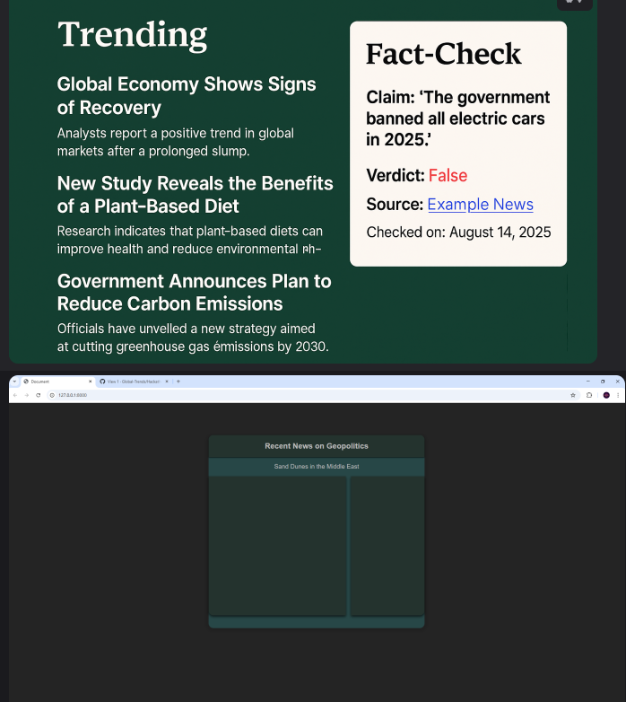

---

### 🗂️ Project Planning Stages

### Team Collaboration and Task Management

Dylan took on a leadership role, overseeing the project board and ensuring tasks were well-organized and progress was effectively tracked. At the project's outset, Valentyna and Jake contributed by drafting detailed user stories. Together, the team transformed these user stories into actionable "To-Do" items on the GitHub project board, assigning priority labels to each task. Once the tasks were structured, team members selected and assigned themselves to the ones they were most eager to tackle.

📋 Project Board Snapshots

- **First Day**: Initial planning and task assignment.
  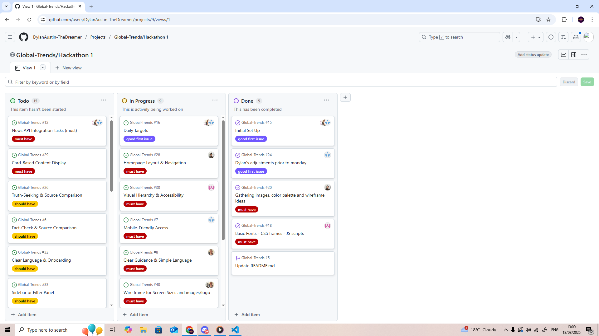
- **Third Day**: Significant progress with an MVP ready and work on additional features underway.
  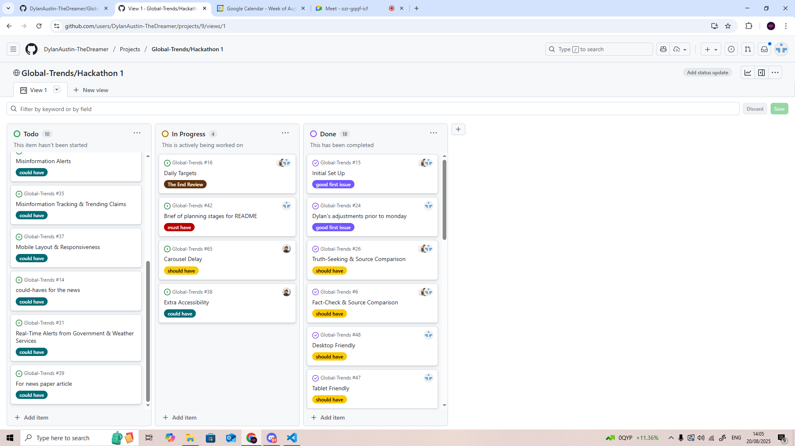
- **Later Progress**: Continued refinement and feature development.
  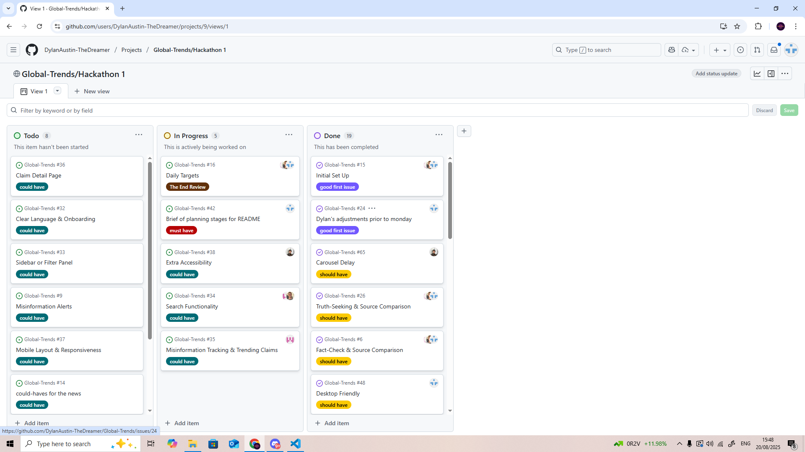

---

### 🎨 Wireframes and Design

 -  Jake made beautiful color-palette

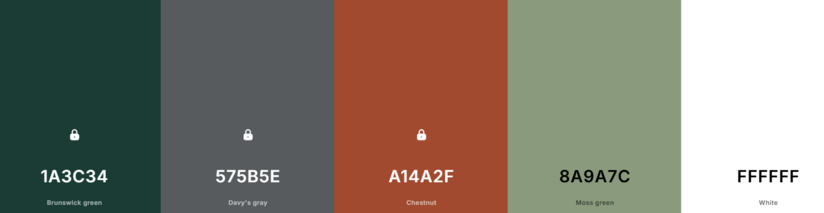

- The wireframes were designed by Daniel, who focused on creating layouts that enhance accessibility and user experience. These wireframes guided the development process and ensured alignment with our goals.

🖼️ Wireframes

- **Wireframe 1**: Initial layout concept for the homepage, focusing on navigation and content placement.
  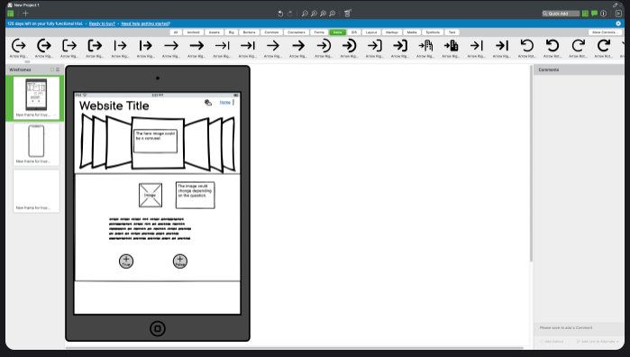
- **Wireframe 2**: Detailed design for the fact-checking section, emphasizing user interaction and clarity.
  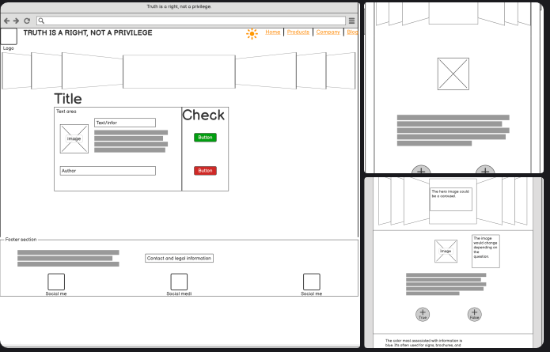
- **Wireframe 3**: Mobile-first design showcasing responsive elements and simplified navigation.
  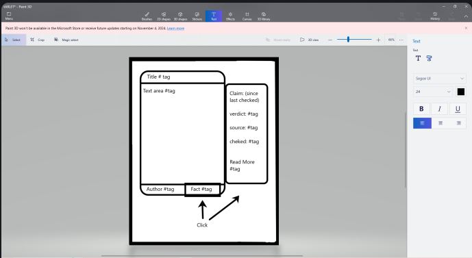

---

### Technologies Used

- **GitHub Copilot**: Assisted in setting up APIs, resolving errors, and providing automatic code solutions based on IntelliCode.
- **CSS Layout Design**: Creative solutions using flex dividers, bootstrap margins, and custom dividers with fixed heights.
- **JavaScript Debugging**: Collaborative debugging of scripts like the search bar to resolve issues such as unintended clearing of article information.
- **API Integration**: Successfully integrated multiple APIs to power dynamic content and fact-checking features. GitHub Copilot played a key role in guiding URL structures, query parameters, and troubleshooting, enabling our team to learn and implement real-time data solutions with confidence.
- **Responsive Design**: Ensured proper display on mobile, tablet, and desktop devices using CSS Grid/Flexbox and media queries.
- **Accessibility-First Approach**: Implemented semantic HTML, ARIA roles, and WCAG compliance to enhance usability for all users.

---

### Testing and Debugging

- **HTML Testing**: W3C HTML Validator found some issues, that were fixed by Dylan.

 Example

- **API Integration**: Extensive errors with getting APIs to work were resolved with the help of GitHub Copilot, which assisted in understanding URLs and query structures.
- **CSS Troubleshooting**: Valentyna faced issues with the trending claims container, which were resolved by adjusting `display: none;` before media queries and fixing JS syntax errors. Additionally, a class selector was mistakenly used instead of an ID selector, which was corrected.
- **JavaScript Debugging**: Several scripts, such as the search bar script, were collaboratively debugged to fix issues like clearing article information unintentionally.

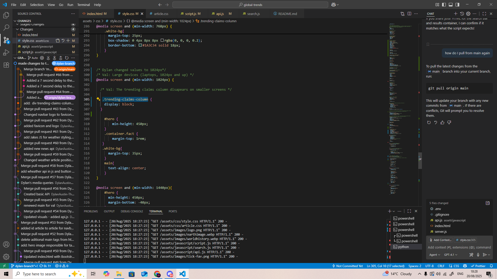
---

## Credits & Acknowledgments

### Design Resources

- **Google Fonts**: Typography and font resources.
- **Web Accessibility Guidelines**: WCAG compliance resources.

### Development Tools

- **GitHub Copilot**: AI-assisted development.
- **VS Code**: Primary development environment.
- **GitHub Pages**: Deployment platform.
- **Browser DevTools**: Testing and debugging.

### API Sources

- **News API** 
[News](https://newsapi.org/) and [Another Sourse](https://gnews.io/), becouse of the limit of free calls per day.
- **Google Fact Check Tools**
[FactCheck](https://toolbox.google.com/factcheck/apis/)
- **OpenWeather API**
[WeatherAPI](https://openweathermap.org/)

### Responsive Design Testing

- **Mobile devices** (320px-768px) ✅
- **Tablet devices** (768px-1024px) ✅  
- **Desktop screens** (1024px+) ✅

### Validator Testing 

- **HTML** ✅ - No errors found in the end using
 [W3C HTML Validator](https://validator.w3.org/)

 HTML Validation 

- **CSS** ✅ - No errors found using [W3C CSS Validator](https://jigsaw.w3.org/css-validator/)

 CSS Validation 

CSS Validation of style.css

CSS Validation of article.css

### Manual Testing
- ✅ **News Feed:** Verified that news articles load on the main page and that images display correctly.
- ✅ **Search Bar:** Tested with various keywords to ensure relevant articles are returned. Handled empty and no-result searches gracefully.
- ✅ **Fact-Check:** Confirmed that fact-check claims are displayed with their sources, and links to sources work correctly.
- ✅ **Weather Forecast:** Checked that the local weather forecast is displayed accurately.
- ✅ **Responsive Design:** Ensured the site displays correctly on mobile, tablet, and desktop screens. All interactive elements are functional across devices.
- ✅ **Navigation:** All internal links and navigation elements work as expected (except UK News link in Navbar, that is a feature for the future developement).
- ✅ **External Links:** Verified that all external links are open in a new tab.

## LightHouse Scores

- ## Mobile

Mobile LightHouse testing

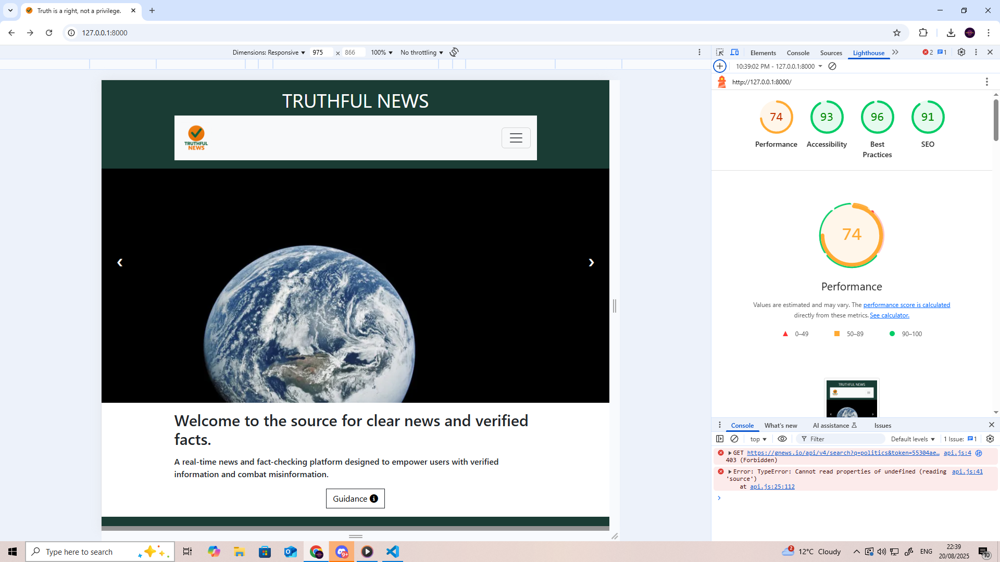

- ## Desktop

Desktop LightHouse testing 

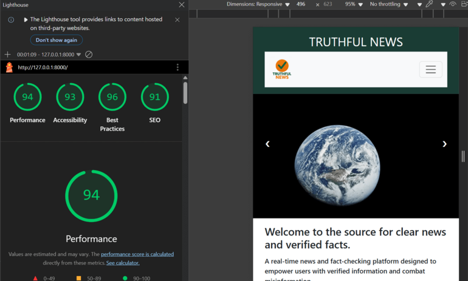

## Deployment

- The site was deployed to GitHub pages. The steps to deploy are as follows: 
  - In the GitHub repository, navigate to the Settings tab 
  - From the left bar menu, select the Pages
  - Once the branch Main has been selected, the page will be automatically refreshed with a detailed ribbon display to indicate the successful deployment. 

The live link can be found here - https://dylanaustin-thedreamer.github.io/Global-Trends/

## Future Features

- **Enhanced News Filtering**: add options for users to filter news articles by category (e.g., politics, technology, health) or country. This will involve adding dropdown menus and updating our API calls to fetch more specific results, giving us a great opportunity to practice handling user input and dynamic content.
- **Bookmark Articles for Later and Share button**: A feature to allow users to save or bookmark articles they want to read later. This will be a fun challenge using browser `localStorage` to store the saved articles, teaching us about client-side storage without needing a complex database. 
- **"How to Spot Misinformation" Guide**: create a dedicated page with a simple checklist and tips to help users learn how to identify fake news. This will be a great way to practice our HTML and CSS skills while adding valuable content that supports our project's mission.
